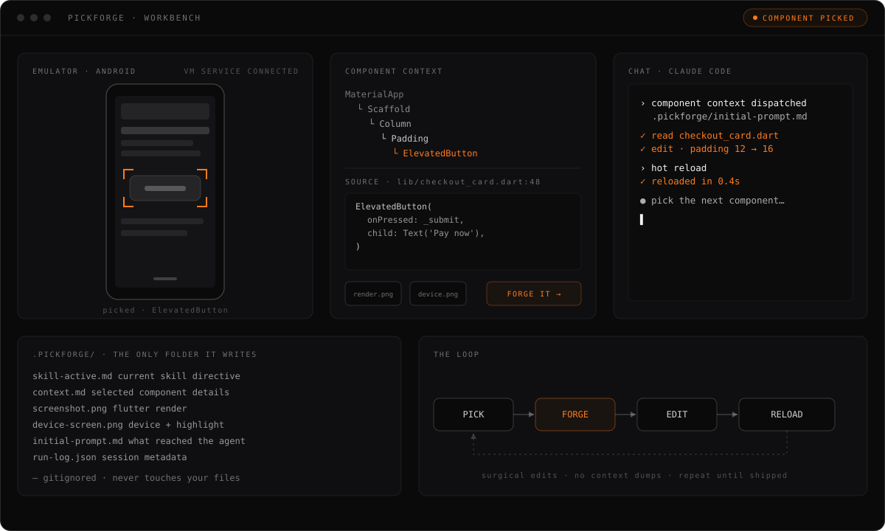

<p align="center">
  
</p>

# PickForge

An agent IDE for mobile developers. PickForge is a local desktop app that runs your app, lets you pick the on-screen element you care about, and forges its context — source location (or best-effort hints), ancestor/accessibility chain, screenshots — straight into an AI coding CLI (Claude Code, Codex, OpenCode) in an embedded terminal. The agent makes a surgical edit; you hot-reload or re-run; repeat.

It works across **Flutter, React Native (Android), native Android, and web** — but not all equally. Support is honest and tiered: Flutter is deep (exact element→source mapping), React Native and native Android are useful (run, inspect, logs, best-effort source hints), web is experimental. See [Framework support](#framework-support) for exactly what each tier means.

PickForge builds the app. PickLab lets agents see, run, and test it. PickArena measures the results.

Local-first. Open source. Built for people who ship. You bring your own agent credentials, and your source stays on your machine — the only things that leave are a startup update check against GitHub Releases (version metadata) and the context you explicitly forge into a third-party agent CLI, which then runs under your own credentials.

## Install

Download from [Releases](https://github.com/pickforge/pickforge/releases) — `.AppImage` (Linux), `.dmg` (macOS), `.msi` (Windows).

Or build from source:

```bash
git clone https://github.com/pickforge/pickforge
cd pickforge
bun install
bun run tauri dev        # Rust shell + SolidJS UI, hot-reloaded
# bun run tauri build    # produce a release bundle (.AppImage / .dmg / .msi)
```

Requires a [Rust toolchain](https://rustup.rs) and [Bun](https://bun.sh) 1.2+. PickForge is built
on [Tauri v2](https://tauri.app) — a Rust core (`crates/pickforge-core`) behind a
Tauri shell (`src-tauri/`) with a SolidJS frontend (`src/`).

The window uses custom chrome (`decorations: false`) — one draggable title bar
with the brand, nav, status, and min/maximize/close controls. On Linux/Wayland,
the window app_id is forced to the bundle identifier `dev.pickforge.app` at
startup via `gtk::glib::set_prgname` in `src-tauri/src/lib.rs` (`enableGTKAppId`
alone doesn't set the xdg_toplevel app_id under WebKitGTK — GTK derives it from
`g_get_prgname()`, which otherwise defaults to the binary name).
Release bundles ship their own desktop entry + icon; for a bare dev binary the
window only shows the PickForge icon once a matching `.desktop` is installed:

```bash
node scripts/install-linux-desktop.mjs            # dev binary (target/debug)
node scripts/install-linux-desktop.mjs --release  # release binary
node scripts/install-linux-desktop.mjs --remove-stale   # drop the old pickforge.desktop
```

Then fully relaunch the window (compositors cache the app_id→icon mapping).

## Quickstart

1. Launch PickForge. On first run it asks you to **Add your first project** — pick the folder of a Flutter, React Native, native-Android, or web project. PickForge detects the framework and shows its [support tier](#framework-support) next to the run button.
2. Inside the workbench, hit **+ New chat** to spawn a persistent agent CLI session in the embedded terminal pane. Each chat keeps its own scrollback across app restarts.
3. **Run** the detected target from the workbench (Flutter run, Metro/Gradle, dev server). Pick the device when the target needs one.
4. Open the inspector and **pick** an element: Flutter attaches the Dart VM-service widget inspector; React Native and native Android use the UIAutomator accessibility inspector; web uses CDP/source-map inspection.
5. Click **Forge it** to dispatch the element's context as a prompt into the active chat.

### The loop

Pick an element, forge its context to the agent, let it edit, hot-reload (Flutter) or re-run, pick the next one. The agent never gets a context dump — it gets exactly the element you pointed at, with its source location (or best-effort source hints), ancestor/accessibility chain, and screenshots.

<p align="center">
  
</p>

## Where it writes your context

By default PickForge keeps each project's chats, runs, screenshots, and context
files in your **PickForge home** (`~/.pickforge/projects/<projectId>/`), outside
the repo — so a fresh clone has nothing extra to ignore. Per project you can
switch to **project-local** storage (a `.pickforge/` folder in the repo) or a
**custom** folder, under **Settings → Context storage**.

When stored project-local, the layout at your project root is:

```
.pickforge/
  .gitignore           # auto-generated, contains "*"
  skill-active.md      # the current skill directive
  widget-context.md    # the selected widget's details
  screenshot.png       # Flutter render (when available)
  device-screen.png    # full device screen with highlight (Android + adb)
  initial-prompt.md    # what PickForge piped to your agent
  run-log.json         # session metadata
```

In home/custom mode the same files live under
`~/.pickforge/projects/<projectId>/` (or your chosen folder) instead — so
transcripts are no longer always under `.pickforge`.

PickForge **never** modifies your `CLAUDE.md`, `AGENTS.md`, or any of your own
files. The repo-write `.pickforge/` marker rule applies to project-local mode
only: if a `.pickforge/` already exists there and wasn't created by PickForge,
it refuses to proceed. Switching storage modes offers to **copy** existing data
to the new location and always leaves the originals in place.

Detailed storage, retention, and migration-backup policy lives in [`docs/architecture/storage.md`](docs/architecture/storage.md).

## Framework support

PickForge declares only the capabilities each framework adapter can actually back, and maps that capability set to a **support tier** — the same badge you see in the workbench next to the run button. The tiers are honest by design; depth that isn't wired isn't claimed.

| Tier | What it means |
| --- | --- |
| **Deep** | Run + exact element→source mapping. The inspector resolves your selection to the precise source location. |
| **Useful** | Run, logs, screenshot, and element inspection, with **best-effort** source hints (text / resource-id / test-id search) — not exact mapping. |
| **Experimental** | Detection plus some tooling, on a thin runtime. |
| **Manual** | Generic fallback: terminal, attachments, and prompts only — no live inspect. |

| Framework | Tier | What works today |
| --- | --- | --- |
| **Flutter** | **Deep** | Run, hot reload, hot restart, stop. Dart VM-service widget inspector with exact selection→source mapping, screenshots, and forge-to-agent. |
| **React Native (Android)** | **Useful** | Metro/Gradle run on a device, UIAutomator accessibility inspector + screenshot, `adb logcat` stream, forge-to-agent with **best-effort** source hints (no exact source mapping). |
| **Native Android** | **Useful** | Gradle run, UIAutomator accessibility inspector + screenshot, `adb logcat` stream, forge-to-agent with **best-effort** source hints. |
| **Web** | **Experimental** | Dev-server run; CDP / source-map inspection (partial). |
| **iOS** | **Deferred** | Detection and command/parse fixtures exist, but iOS needs macOS and a product decision — it is **tracked, not working**. Don't expect a live run or inspector yet. |

Notes:

- Only Flutter declares exact `mapSelectionToSource`. Every other adapter forges a confidence-ranked **source-candidate** hint and says so — it never pretends to know the exact line.
- Detection, command building, and log/hierarchy parsing are fixture-tested (no device required); the live run/inspect paths above are what's wired end-to-end.
- Architecture and the full capability/tier vocabulary live in [`docs/architecture/target-adapters.md`](docs/architecture/target-adapters.md).

### Roadmap (not yet built)

These are tracked but **not** shipped — don't rely on them yet:

- A **web CDP inspector** that captures DOM/console/network from a live session.
- An **MCP endpoint** exposing PickForge's run/inspect/forge tools to agents.
- **iOS** live run + accessibility inspection (needs macOS).

## Stack

| Category | Supported |
| --- | --- |
| Agents | Claude Code, Codex, OpenCode. More planned. |
| Devices | Android emulator / device via adb. iOS Simulator and desktop targets are not wired yet. |
| Terminal | Embedded `xterm` + PTY — no external terminal apps required. Per-chat scrollback persists under the project's resolved context storage (project-local example: `.pickforge/chats/<chatId>/transcript.log`). |

## Branding

Canonical PickForge brand assets live in `assets/branding/`. The set follows the Pickforge Studio v2 system: dark canvas, off-white selection bracket, and one ember accent.

## Contributing

PRs welcome. See [SECURITY.md](SECURITY.md) for vulnerability reporting and [CODE_OF_CONDUCT.md](CODE_OF_CONDUCT.md) for expectations.

Design spec: `docs/superpowers/specs/2026-04-23-pickforge-design.md`.
Implementation plan: `docs/superpowers/plans/2026-04-23-pickforge-mvp.md`.

## License

MIT — see [LICENSE](LICENSE).

## Third-party software

PickForge bundles the [scrcpy](https://github.com/Genymobile/scrcpy) server binary
(`src-tauri/resources/scrcpy-server-v3.3.3`), © Genymobile / Romain Vimont, licensed
under the [Apache License 2.0](https://www.apache.org/licenses/LICENSE-2.0). It is
redistributed unmodified — see [`NOTICE`](NOTICE) for details.

---

<p align="center">
  <a href="https://pickforge.dev">
    
  </a>
</p>
